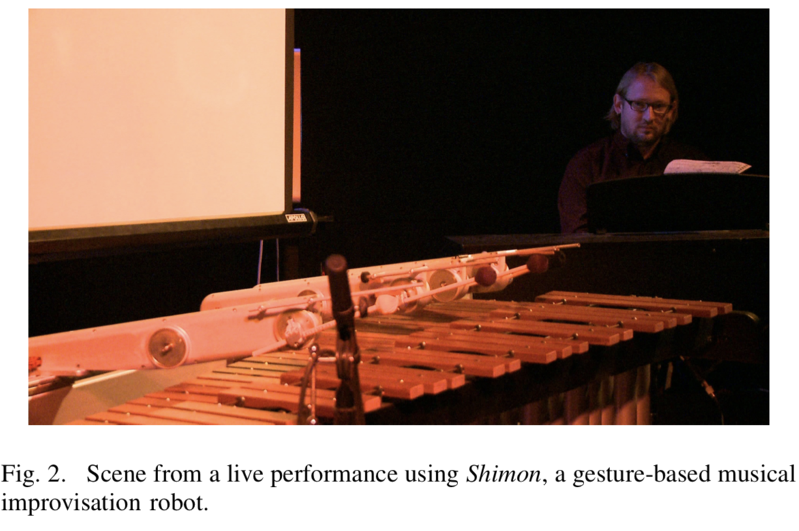

# performingRobots

## [On Stage: Robots as Performers](http://guyhoffman.com/publications/HoffmanRSS11Workshop.pdf)

### Introduction:

Getting insights performative arts could help improve the coordination and joint-action timing of human-robot interaction(HRI). It's important to improve these characters because these improvements make those robots look more "natural"(human-like).

### I. Robots on Stage
Two things must be put into consideration when having robots on stage:
  1. Preprogrammed actions:
      - robots are pre-programmed to certain verbal cues and postions to perform particular set of actions. While this looks  
        responsive, it lacks the natural fluency of behaviors that human actors have on stage
   2. Realtime actions:
      - using a "real-time adaptive and autonomatic robotic improvisation system"
      - robots are synchronized with the human player to simultaneously response to other actors(humans and robots)
      
  

### II. Robots on Stage
Two lessons robots can learn from human actors:    
  1. Conintuity- inner monologue:
       - An actor's inner monologue is shown through out the play through actions or monologue-this in term creates a   
         narrative for that actor
       - Implement to robots to create a "more fluent and acceptance in human-robot joint activities"
            - could be implemented by making the robot activity continuous            
   2. Responsiveness:
      - "a scene is not happening within any of the actor’s minds"
      - Robot's responsiveness is based on their interaction with other actors(humans and other robots)
          - quick responses: some responses are based on incomplete information-makes it natural in a way because human
            tend to act that way  

  

## Project Propsoal

### I. About the class performance

  Since this is a performing robots class, we could have stage where our robots could be staged to do their own thing. The audience could either focus on each robot to see in detail what are the robot's specialties. In addition, the audience could look at the performing as a whole and try to create a story of what is going on with all the robots. Some people might think that those robots are doing nothing in relation to other robots, but some people might try to draw some connections between those robots to create stories. Thus, audience might see the stage as a big chaos or a beautifully-weaved story.
  
 ### II. What I want to make: Humanoid robot
 
  -consists of a lot motors to recreate the joints that humans have so the robot could move "fluently"
  
  <!---->
  
  
  
  I will try to make those joints work by testing the implemenation of different motors at those joints. 
  
## Project Updates

After I did a detailed planning of my robot body, I found out that I'll need two extra servo motors for the neck and the head.

  

I think the most difficult part of my project is creating the arms for my robot because they are consisted of so many joints 
which requires me to consider the weight distribution through out the arms. Placing one servo motor at each joint could be 
problematic becuase each part of the arm might not be able to hold the weight. I was thinking of using wires to connect to 
those joints, so the motors could be placed inside the body of the robot to control those wires. I did an extensive research 
on this mechanism and found it problematic because I wouldn't be able to move the parts of the arms in the directions that I i
intended to. Also, I think the mechanism is too complicated for me to build my robot's arms which perform very simple
motions.

I turned back to the original idea of using different motors for different joints of the arms. For the attaching the whole arm to the body, I will use big servo motor because it has more strength and it will not add weight to the arm. For the rest of the joints in the arms, I will use small motors because they are less heavy and have similar power to the big servo motors. I aslo plan to use different materials for each part of the arms. For the upper part of the arm, I will use wood/cardboard because I need to make sure that it will be able to hold the lower part of the arm and the hand. For the lower part of the arm, I will use foam/cardboard because I want to lessen the weight that the upper part of the arm needs to hold. In addition, the lower part of the arm is controlled by a small servo motor, so I need to reduce the weight to make sure the small motor could hold it. For the hand, I will use foam. I hope that by using different materials I will be able to lessen the weight for the motors to be able to move those parts.

  
   
## Project Updates II

I was working on implementing the mechanism of my robot's arm. I worked with cardboard to create different parts of the robot's arm instead. I figured out that I could use different kinds of cardboard for each part of the arm. For instance, I used thicker cardboard for the upper part of the hand and used thinner cardboard for the lower part of the arm. Since the thicker cardboard is quite strong, it is able to hold the other parts of the arm.

  

Each part of the arm is attached by one motor:

  

The upper part of the arm is attached to a big servo motor because it has to hold the weight of the whole arm.

 

Balancing the weight throughout the arm is really important here, so I need to make sure that the joint are stably attached. In order to do that, I can't attach the lower part of the arm directly to the motor. Instead, I need to attach a small piece of cardboard to the motor's gear first and then attach the lower part of the arm to that cardboard. By doing so, the lower part of the arm would not bend. 

 

